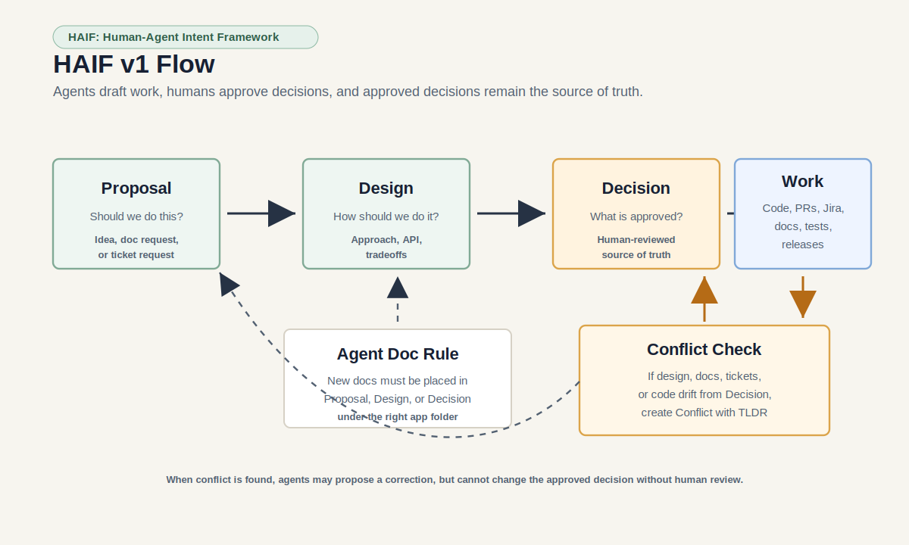

# HAIF: Human-Agent Intent Framework

**Shared intent before agent execution.**

HAIF, the proposed Human-Agent Intent Framework, is a shared coordination layer that helps teams preserve human-owned intent, review, and alignment before AI agents turn ideas into tickets, docs, decisions, or execution.

AI agents make individual work faster. They also make it easier for teams to create duplicate tickets, conflicting plans, stale docs, and implementation drift from partial context. HAIF gives humans and agents a simple lifecycle, record format, and preflight workflow so proposals become committed work only after ownership and review are clear.

## Why HAIF Exists

Current tools each own part of the work:

- Jira owns tasks.
- GitHub owns code.
- Slack and Teams own conversation.
- Confluence and docs own knowledge.
- AI agents own generation.

None of them reliably owns shared human-agent intent.

HAIF adds that missing layer:

```text
Proposal -> Design -> Decision -> actual implementation
```



Agents can create proposals and draft designs. Humans approve decisions. Actual implementation stays in existing tools such as Jira, GitHub, docs, tests, and release systems.

When an agent creates a new doc, it should not create a random standalone document. It should classify the document as a `Proposal`, `Design`, or `Decision`, place it in the matching `.haif/records` folder, and link it to the related workstream. If a new or updated doc, ticket, design, or implementation conflicts with an approved `Decision`, the decision is the source of truth. The agent should try to correct the artifact back to the decision; if it cannot, it should create a `Conflict` record with a reviewer-focused TLDR.

## If You Already Use AI Agents And Repo Instructions

HAIF does not replace your existing agent instructions. It adds shared coordination state for Codex, Claude, Cursor, Copilot-style agents, and other AI agents to read before they act.

```text
your-repo/
  AGENTS.md          <- tells agents how to behave
  .haif/records/    <- tells agents what the team has agreed on
```

Add a HAIF section to your existing repo instruction file, such as `AGENTS.md`, `CLAUDE.md`, or another tool-specific instruction file:

```markdown
## HAIF Workflow

This repo uses HAIF: Human-Agent Intent Framework.

Before significant planning, ticket creation, docs, or code changes:

1. Read `.haif/records`.
2. Run `haif preflight` if available.
3. Continue to implementation only if there is an approved HAIF `Decision` and no unresolved conflict.
4. If alignment is missing, create a HAIF `Proposal` instead of starting implementation.
5. If solution details are unclear, create or update a HAIF `Design`.
6. Put new agent-created docs in the matching HAIF stage folder: `proposals`, `designs`, or `decisions`.
7. If a doc, ticket, design, or implementation drifts from an approved `Decision`, treat the `Decision` as source of truth and create a `Conflict` if the artifact cannot be corrected safely.

Agents may create proposals and draft designs, but humans approve decisions before implementation.
```

The day-to-day flow is:

```text
Human or agent sees work
        |
        v
Agent reads AGENTS.md
        |
        v
Agent checks .haif/records
        |
        v
Agent runs haif preflight
        |
        +--> aligned: plan, code, document, or create tickets
        |
        +--> not aligned: create Proposal and ask for human review
```

In short: keep `AGENTS.md`, add HAIF rules to it, create `.haif/records`, and ask agents to check for an approved decision before meaningful implementation work.

`haif init` creates or updates `AGENTS.md` automatically. If an `AGENTS.md` file already exists, HAIF appends a marked HAIF workflow section instead of replacing your current instructions.

## Quick Start: Try HAIF By Cloning This Repo

Works on macOS, Linux, and Windows with Node 20+.

```bash
git clone https://github.com/AthiraSPillai/haif.git
cd haif
npm install
npm run build
npm link
```

After `npm link`, the `haif` command should work from any repo:

```bash
haif --help
```

Initialize HAIF records in the cloned repo:

```bash
haif init
haif new proposal "Reduce duplicate agent-created Jira tickets"
haif validate
haif preflight --scope jira,docs
```

For local development without publishing the CLI package:

```bash
npm run haif -- validate
```

If global linking is unavailable or blocked by local permissions, use the built CLI path instead:

```bash
node packages/cli/dist/index.js validate
```

## Use HAIF In Your Existing Project

Use this when you already have a project with Codex, Claude, Cursor, Copilot-style agents, or repo instruction files.

1. Clone HAIF somewhere on your machine:

   ```bash
   git clone https://github.com/AthiraSPillai/haif.git
   cd haif
   npm install
   npm run build
   npm link
   ```

   If `npm link` fails on macOS or Linux because of npm permissions, use a Node version manager or skip global linking and use the fallback path shown below.

2. Go to your own project:

   ```bash
   cd path/to/your-project
   ```

3. Initialize HAIF records in your project:

   ```bash
   haif init
   ```

4. Add a proposal before significant agent-assisted work:

   ```bash
   haif new proposal "Refactor onboarding flow"
   ```

5. Validate records:

   ```bash
   haif validate
   ```

6. Run preflight before agents create tickets, docs, designs, or code:

   ```bash
   haif preflight --scope onboarding
   ```

7. Add HAIF guidance to your existing repo instruction file, such as `AGENTS.md` or `CLAUDE.md`.

   Use the example in [docs/agents-md.md](docs/agents-md.md).

### Fallback: Use HAIF Without Global Install

If `haif` is not available globally, point directly to the cloned HAIF CLI.

macOS/Linux:

```bash
node /path/to/haif/packages/cli/dist/index.js preflight --scope onboarding
```

Windows PowerShell:

```powershell
node "C:\path\to\haif\packages\cli\dist\index.js" preflight --scope onboarding
```

Use this fallback in `AGENTS.md` or `CLAUDE.md` if your team does not want a global CLI.

```markdown
Run HAIF preflight with:

node /path/to/haif/packages/cli/dist/index.js preflight --scope onboarding
```

## Use HAIF With Python

1. Clone HAIF:

   ```bash
   git clone https://github.com/AthiraSPillai/haif.git
   cd haif
   ```

2. Run the Python CLI from the HAIF repo:

   Windows PowerShell:

   ```powershell
   $env:PYTHONPATH="packages/python/src"
   python -m haif.cli init
   python -m haif.cli new proposal "Reduce duplicate agent-created tickets"
   python -m haif.cli validate
   python -m haif.cli preflight --scope jira,docs
   ```

   On macOS or Linux:

   ```bash
   PYTHONPATH=packages/python/src python -m haif.cli init
   PYTHONPATH=packages/python/src python -m haif.cli new proposal "Reduce duplicate agent-created tickets"
   PYTHONPATH=packages/python/src python -m haif.cli validate
   PYTHONPATH=packages/python/src python -m haif.cli preflight --scope jira,docs
   ```

## Team Pilot Workflow

Start with one project or workstream. Use HAIF as a lightweight pre-work alignment check before agents create Jira tickets, docs, designs, or code.

```text
Idea or agent suggestion
        |
        v
HAIF Proposal
        |
        v human review
HAIF Design
        |
        v human approval
HAIF Decision
        |
        v
Jira ticket / code / docs / tests
        |
        v
PR or final output links back to HAIF Decision
```

Recommended first team rule:

> Agents can propose work, summarize context, and draft designs, but committed Jira tickets and implementation should link to a human-approved HAIF decision.

For a small pilot, start with only three record types:

- `Proposal`: possible work from a human or agent.
- `Design`: proposed approach, options, tradeoffs, and risks.
- `Decision`: reviewed direction that agents and humans can treat as current.

HAIF also creates a `conflicts` folder by default because drift and duplicate work can happen at any point. Add optional extension records after the team has used this for a few real tasks.

## Tutorial: Updating An API With HAIF

This example shows how a team can use HAIF when an AI agent is helping create or update an API.

Scenario:

> The team wants to add `GET /v2/accounts/{id}/status` so onboarding, billing, and support tools can use one shared account-status contract.

### 1. Initialize HAIF In The Project

Run this once in the project repo:

```bash
haif init
```

This creates:

```text
AGENTS.md
.haif/
  records/
    proposals/
    designs/
    decisions/
    conflicts/
```

### 2. Start With A Proposal

Before asking an agent to design or implement the API, create a proposal:

```bash
haif new proposal "Add account status API"
```

Edit the generated file under `.haif/records/proposals/`:

```yaml
type: Proposal
id: proposal-add-account-status-api
title: Add account status API
tldr: Proposes a shared account-status API so onboarding, billing, and support stop deriving status differently.
status: proposed
owner: platform-lead
scope: [accounts, onboarding, billing, support]
related: [jira://PLAT-142]
```

The proposal is not committed work yet. It is a reviewable suggestion.

### 3. Draft The Design

After the team agrees the proposal is worth exploring, create a design:

```bash
haif new design "Account status API design"
```

Edit the generated file under `.haif/records/designs/`:

```yaml
type: Design
id: design-account-status-api
title: Account status API design
tldr: Defines the v2 account-status endpoint, response fields, compatibility behavior, and rollout plan.
status: proposed
owner: api-owner
scope: [accounts, api-contract]
related: [proposal-add-account-status-api]
reviewers: [platform-lead, security-reviewer]
confidence: draft
```

Ask the agent to draft options, but keep the design in `proposed` until humans review it. Do not start coding from a proposed design.

### 4. Record The Human Decision

After design review, create a decision:

```bash
haif new decision "Approve account status API design"
```

Edit `.haif/records/decisions/`:

```yaml
type: Decision
id: decision-approve-account-status-api-design
title: Approve account status API design
tldr: Approves the v2 endpoint with stable status enum, backward-compatible rollout, and explicit owner.
status: approved
owner: api-owner
scope: [accounts, api-contract]
related: [proposal-add-account-status-api, design-account-status-api]
reviewers: [platform-lead, security-reviewer]
confidence: canonical
```

Now an AI agent has reviewed context it can safely use for implementation.

### 5. Run Preflight Before The Agent Codes

Before Codex, Claude, Cursor, or another agent starts implementation:

```bash
haif preflight --scope accounts,api-contract
```

If preflight reports a missing approved decision or unresolved conflict, stop and review before coding.

If the agent updates a design document, doc, ticket, or implementation in a way that drifts from the approved decision, create a drift conflict:

```bash
haif drift-conflict \
  --app=accounts \
  --decision=decision-approve-account-status-api-design \
  --artifact=design-account-status-api \
  --summary="The updated design changes the response shape approved in the decision."
```

HAIF creates the conflict file under `.haif/records/conflicts/accounts/` and pre-fills it with the TLDR, source decision, drifting artifact, observed drift, agent action, and human review questions. The agent should correct the artifact back to the approved decision when possible; if the approved decision may need to change, humans review and create a new decision.

### 6. Link Actual Implementation In Existing Tools

Implementation is not a HAIF stage in v1. Actual work stays in Jira, GitHub, docs, tests, and release systems.

Use Jira tickets, PR descriptions, or docs to link back to the approved decision.

### 7. Optional: Capture Agent Work

If your team wants more traceability, create an optional `AgentRun` when an agent generates a plan, code, docs, or ticket breakdown:

```bash
haif new agent-run "Codex implementation plan for account status API"
```

Use the record to capture:

- source records used
- files touched
- assumptions made
- output generated
- follow-up review needed

### 8. Optional: Handle Conflicts Without Editing History

Suppose another team is already changing account state for billing. Create a conflict:

```bash
haif new conflict "Billing account state change overlaps account status API"
```

After human review, append a resolution report instead of editing the original conflict:

```bash
haif resolve-conflict conflict-billing-account-state-change-overlaps-account-status-api \
  --outcome=resolved \
  --summary="Billing keeps its internal state field, but public consumers use the new account-status API contract." \
  --reviewer="platform-lead" \
  --related=decision-approve-account-status-api-design
```

HAIF stores this in `.haif/reports/conflict-resolutions.jsonl` and `haif validate` checks that the report history was not manually edited.

### 9. Use HAIF During PR Review

In the PR description, link the HAIF records:

```markdown
HAIF:
- Proposal: proposal-add-account-status-api
- Design: design-account-status-api
- Decision: decision-approve-account-status-api-design
- AgentRun: agent-run-codex-implementation-plan-for-account-status-api
```

Reviewers can quickly check:

- Does the implementation match the approved decision?
- Did the agent expand scope?
- Did any API, data model, security, or ownership decision drift?
- Are conflicts resolved through append-only reports?
- Are docs generated from canonical records?

### 10. Validate Before Merge

Run:

```bash
haif validate
```

Use HAIF as a coordination check, not a replacement for tests, security review, or architecture review.

## Record Folders

HAIF keeps records in stage-specific folders so teams do not end up with one large design file or one crowded records directory.

```text
.haif/
  records/
    proposals/
    designs/
    decisions/
    conflicts/
```

`haif init` creates only these default folders. HAIF can still create optional extension folders later, such as `agent-runs`, `tasks`, `reviews`, `signals`, or `intents`, if the team chooses to use those record types.

`haif new proposal "Title"` creates a file under `.haif/records/proposals/`.

`haif new design "Title"` creates a file under `.haif/records/designs/`.

`haif new decision "Title"` creates a file under `.haif/records/decisions/`.

Use `--app` to keep records organized by application, service, or workstream:

```bash
haif new proposal "Add account status API" --app=accounts
haif new design "Account status API design" --app=accounts
haif new decision "Approve account status API design" --app=accounts
```

This creates:

```text
.haif/
  records/
    proposals/
      accounts/
    designs/
      accounts/
    decisions/
      accounts/
```

Agents should use the stage folder first, then the application/workstream subfolder. For example, an API design for the accounts service belongs under `.haif/records/designs/accounts/`, not in a generic docs folder.

Validation, preflight, overlap detection, review status, and context export read records recursively, so older flat `.haif/records/*.md` files still work.

## Conflict Resolution Reports

Conflict records are historical records. When a conflict is resolved, HAIF appends a tamper-evident report instead of rewriting the conflict record.

Conflicts can be created at any point, but the most important conflicts are decision conflicts: two approved or proposed decisions that point in different directions. Put those under the relevant application/workstream conflict folder and link the decisions with `--related`.

```bash
haif new conflict "Account status decision conflicts with billing state decision" \
  --app=accounts \
  --related=decision-approve-account-status-api-design,decision-billing-state-model
```

```bash
haif resolve-conflict conflict-example \
  --outcome=resolved \
  --summary="Human-reviewed resolution summary." \
  --reviewer="reviewer-name"
```

Resolution reports are stored in:

```text
.haif/reports/conflict-resolutions.jsonl
```

Each report is hash-chained to the previous report. `haif validate` checks the chain and reports manual edits, reordered lines, or deleted history. See [docs/conflict-resolution.md](docs/conflict-resolution.md).

## Repo Contents

- `docs/`: framework docs, lifecycle, review gates, Jira/Codex/Claude/GitHub guidance, and adoption playbook.
- `schema/`: JSON schemas for HAIF records and lifecycle configuration.
- `templates/`: Markdown templates for core HAIF record types.
- `examples/`: small-team, Jira-first, and Codex preflight examples.
- `packages/cli/`: Node CLI for validation, record creation, preflight, overlap detection, review status, and context export.
- `packages/python/`: Python SDK and CLI for AI engineering, data, and enterprise automation workflows.
- `assets/`: diagrams for articles, docs, and presentations.
- `AGENTS.md`: repo-local instructions for Codex, Claude, and similar agents.

## Core Record Types

Every HAIF record should include a `tldr` field: one or two sentences that tell a human reviewer what changed, why it matters, and what decision or attention is needed.

See [docs/tldr.md](docs/tldr.md) for TLDR guidance.

- `Signal`: raw observation or issue.
- `Proposal`: suggested work, not yet accepted.
- `Design`: proposed technical or operational direction.
- `Decision`: approved, rejected, or superseded direction.
- `Task`: optional extension record for execution work, often mapped to Jira.
- `Review`: human review checkpoint.
- `Conflict`: duplicate, overlapping, or contradictory work.
- `AgentRun`: agent-generated plan, ticket, doc, or code summary.

## CLI Commands

```bash
haif init
haif validate
haif new proposal "Title" --app=app-name
haif new design "Title" --app=app-name
haif new decision "Title" --app=app-name
haif new conflict "Title" --app=app-name --related=decision-a,decision-b
haif drift-conflict --app=app-name --decision=decision-id --artifact=design-or-doc-id --summary="..."
haif preflight
haif detect-overlap
haif review-status
haif export-context
haif resolve-conflict conflict-id --outcome=resolved --summary="..." --reviewer="..."
```

## Python Support

HAIF also ships a dependency-free Python implementation:

```bash
set PYTHONPATH=packages/python/src
python -m haif.cli init
python -m haif.cli validate
python -m haif.cli preflight --scope jira,docs
```

See [docs/python.md](docs/python.md).

## Human Review Rules

HAIF v1 expects human approval at the important transition:

- `Design -> Decision`
- Major scope or design drift

Agents may not approve their own proposals, designs, decisions, or release readiness.

## License

Apache-2.0. See [LICENSE](LICENSE).
